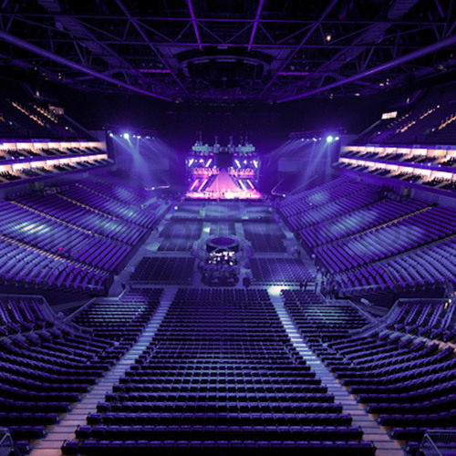
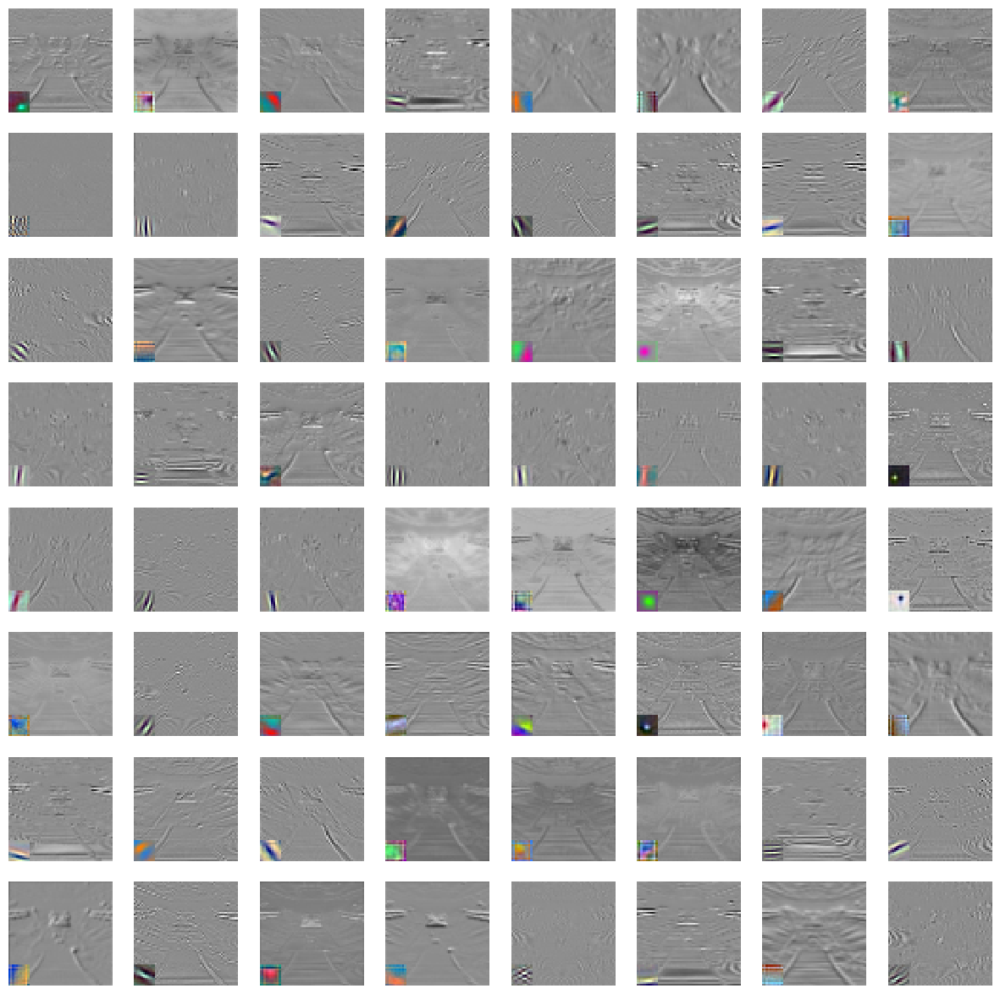

# VenueFillCheck
 
Program that can analyze a photo of a venue to see if it is filled or empty

Understanding whether a concert hall is filled or not through photos can be beneficial in the context of event management, marketing, and audience engagement

1. Event Planning and Management:
 - Capacity Planning: Analyzing historical data of filled and unfilled concert halls can help event organizers optimize future event capacities. This information is crucial for planning logistics, security, and overall event experience.
2. Audience Engagement:
 - Enhancing Audience Experience: Understanding the factors influencing attendance can help organizers improve the overall audience experience. For instance, identifying features in photos that correlate with a filled venue (e.g., stage setup, lighting, crowd engagement) can guide improvements.
3. Revenue Optimization:
 - Ticket Pricing Strategies: Analyzing data on filled and unfilled concert halls can inform ticket pricing strategies. For popular events, organizers may adjust prices to maximize revenue, while for others, they may implement promotions to boost attendance.
4. Logistics and Resource Allocation:
 -Staffing and Resource Planning: If certain types of events consistently attract larger crowds, organizers can adjust staffing levels, security measures, and other resources accordingly.

I've listed 4 here but the problems it could solve are not limited to only theses that i have just mentioned but these would be the major areas that could be benefited immediately.

We can start to create a program to do this task by 
1.  First gathering a photo deck of venues that are filled and venues that are empty 
    This is here is mydata deck 
[Google slides 50 pictures](https://docs.google.com/presentation/u/0/d/1trhebZ4PCf9QhRP3bUlqgMEetYf8O9wwuYlEbyyFDxs/edit)
2. Then we define alexnet model
3. then transform an image to be used in model
4. Look at feature map with random layer applied to photos 

This is an example of a image and what the featrue map would look like 
[FEATURE MAP code](https://colab.research.google.com/drive/1gpZ1TR_lGdYBoWXwzSdV9Zz9BcRQJ5yO?usp=sharing) 
**REGULAR IMAGE**

  
**FEATRUE MAP** 

 so detecting certain features that repeat the program will learn how to group the photos

the network learns to activate specific filters in response to certain features present in the input images. If certain features are indicative of whether a concert venue is filled or empty in your case, the network may learn to recognize and leverage these features for classification.

